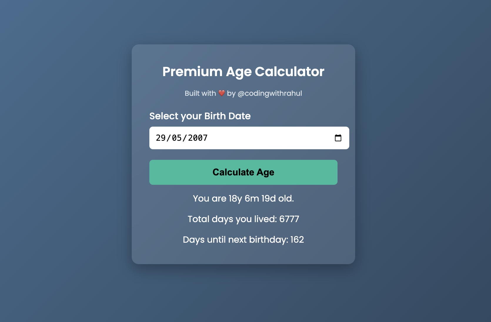

# Age Calculator

Modern Age Calculator built with HTML, CSS & JavaScript  
Designed and developed by **@codingwithrahul**

# Features
- Calculates age in years, months, and days
- Displays total days lived
- Shows countdown to next birthday
- Clean, responsive, premium UI

# Tech Used
- HTML5
- CSS3 (modern design)
- Vanilla JavaScript

# Live Demo
https://codingwithrahul.github.io/age-calculator/

# File Structure
index.html
style.css
script.js

# Screenshot

